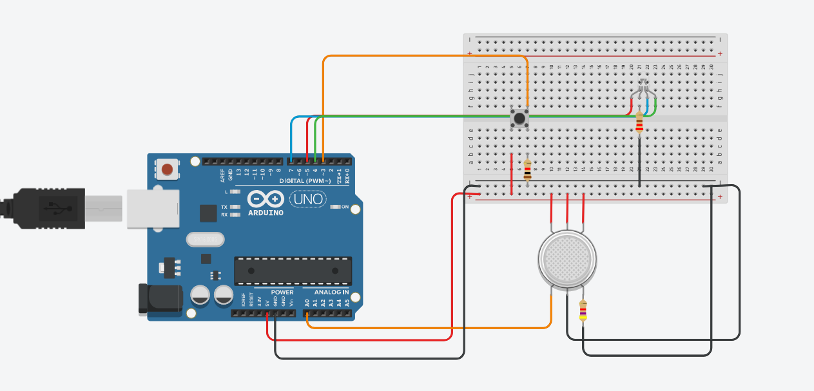

# 🚨 M.A.B. — Monitor de Adulteração em Bebidas

Sistema embarcado utilizando Arduino para detecção de possíveis adulterações em bebidas alcoólicas através da análise de vapores.

---

## 📸 Demonstração do Projeto



---

## 📖 Sobre o Projeto

O **M.A.B. (Monitor de Adulteração em Bebidas)** é um sistema embarcado desenvolvido com Arduino que analisa vapores alcoólicos utilizando um sensor de gás para identificar possíveis variações associadas à adulteração de bebidas.

O sistema realiza leituras contínuas, aplica média para reduzir ruído e utiliza um **baseline fixo com tolerância configurável** para detecção de anomalias.

---

## ⚙️ Funcionalidades

- 🔘 Botão liga/desliga (modo toggle)
- ⏳ Tempo de aquecimento do sensor (~15 minutos recomendado)
- 📊 Leitura com média de 50 amostras
- 📏 Baseline fixo para referência
- 🎯 Detecção baseada em tolerância configurável
- 💡 Indicação visual por LED
- 🖥️ Saída no monitor serial (debug)

---

## 🚦 Estados do Sistema

| Estado       | LED    | Descrição                      |
|--------------|--------|--------------------------------|
| 🟢 Normal     | Aceso  | Bebida dentro do padrão        |
| 🔴 Suspeito   | Aceso  | Possível adulteração detectada |
| 🟡 Aquecendo  | Aceso  | Sensor em estabilização        |

---

## 🔌 Componentes Utilizados

- Arduino Uno (ou compatível)
- Sensor de gás (MQ-3 recomendado)
- Botão push-button
- LED
- Resistores
- Jumpers

---

## 🔌 Pinagem

| Componente     | Pino |
|----------------|------|
| Sensor de gás  | A0   |
| Botão Power    | 3    |
| LED            | 5    |

---

## 🧠 Lógica do Sistema

1. O sistema inicia desligado.
2. O botão alterna o estado (liga/desliga).
3. Ao ligar, o sensor passa por aquecimento.
4. Após estabilização, inicia coleta de dados.
5. São realizadas 50 leituras e calculada a média.
6. A média é comparada com um **baseline fixo**.
7. A detecção ocorre pela diferença absoluta:

```cpp
diferença = abs(media - baseline);